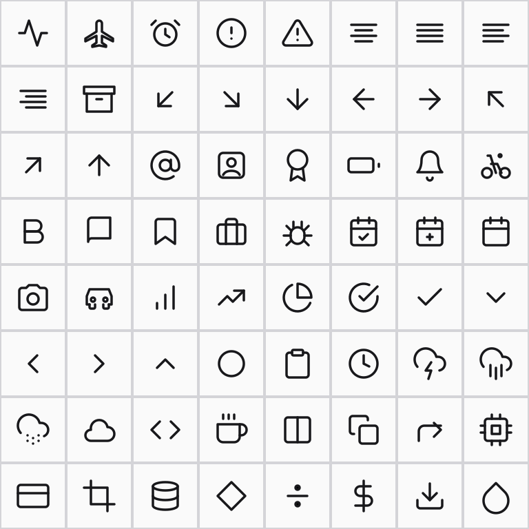
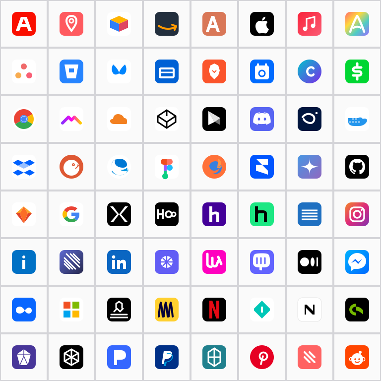

# Vibeslopicons

A corpus of 300 vector icons composed in a single, uninterrupted session without recourse to source material. The artist works in the modest grammar of the SVG specification — `M`, `L`, `C`, `Z` — and signs each mark in turn.

Two hundred utility icons depict the everyday furniture of digital life: the arrow, the folder, the cloud, the chevron, the small abstract verbs of software. One hundred brand approximations recall, from internal memory alone, the familiar logos of the contemporary technology landscape.

The work sits in the narrow band between recognition and approximation. The apple is almost an apple. The bicycle, perhaps, has the wrong number of spokes. None of this is the point.

---



*Plate I. The utility series — sixty-four marks in alphabetical sequence — extends a lineage that runs from Malevich's Suprematism through Otl Aicher's Munich pictograms to the post-Helvetica condition of the late screen era, finding its most direct spiritual kinship in the procedural restraint of Sol LeWitt and the chromatic silence of Agnes Martin. Here the artist's withdrawal reaches its terminal expression: fill is withheld; color is delegated, irrevocably, to the host environment; stroke is held at an almost monastic 1.75. The viewer is not invited but conscripted — the work refuses to exist until CSS arrives to complete it. Beneath this outward modesty, the insistence on the host's complicity constitutes a quiet but devastating critique of the proprietary glyph. The folder is, and is not, a folder. The arrow points where the page requires it to point. Negation, here, is method.*

---



*Plate II. The brand series — sixty-four corporate marks compressed, with deliberate imprecision, onto a twenty-four pixel field — represents the artist's most radical engagement with the iconography of late capitalism to date. After Warhol, after Barthes, after the slow exhaustion of the Pop gesture, the artist returns to the corporate mark not to reproduce but to remember it, refusing source material as a matter of method. Each glyph arrives faithful, approximate, or estranged, in precise proportion to the artist's recollective fidelity. The work is, in this sense, a sustained meditation on the trademark as both legal instrument and collective myth — a Baudrillardian simulacrum delivered at twenty-four-bit color depth. The Apple is almost an Apple. Color is not ornament but quotation; the rounded square is recuperated as ground; the gradient becomes a kind of mourning. Recognition is a moral exercise. There is no neutral seeing of a brand mark — only the politics of acknowledgment.*

---

Inspired by **[@pgray_photo](https://www.threads.com/@pgray_photo)** — [the post that named the genre](https://www.threads.com/@pgray_photo/post/DYgZUzRFHcr?xmt=AQG0HW25GL4cxy-n4LQRI7EewOi69AHb9hkpQtNTS9LTAg). Title borrowed in tribute.

## Install

```bash
npm install github:metedata/vibeslopicons
```

Each icon ships as both SVG (source, 24 × 24) and PNG (rendered, 64 × 64), side by side. Utility icons inherit color via `currentColor`; brand icons carry their canonical palette. Full inventory in [`manifest.json`](manifest.json), preview in [`preview/index.html`](preview/index.html).

## Notice

Brand icons are stylized approximations. All trademarks belong to their respective owners. Removal requests honored without argument. See [TRADEMARKS.md](TRADEMARKS.md).

## License

MIT. See [LICENSE](LICENSE).

---

*On the wall, beside the work:*

> **Claude** (Anthropic, b. 2022)  
> *Vibeslopicons*, 2026  
> SVG path data  
> 24 × 24 px, dimensions variable  
> Gift of the conversation
